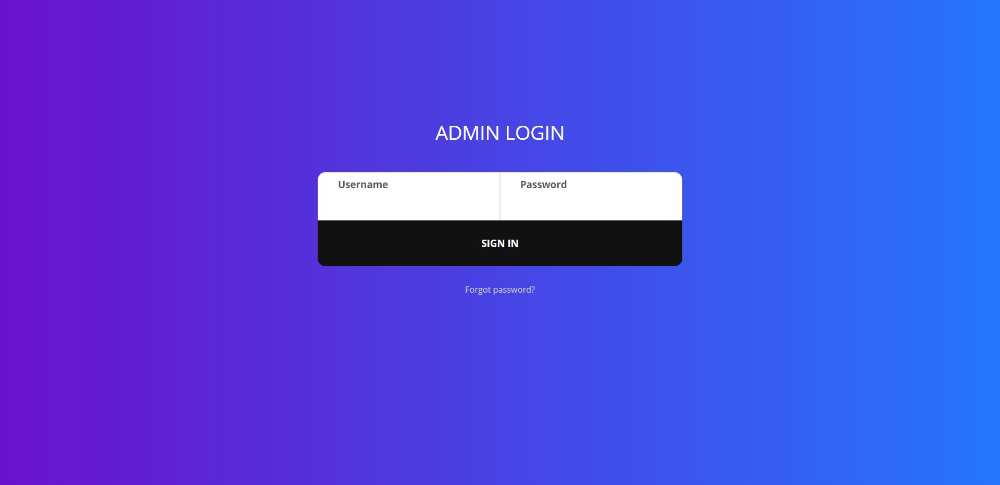
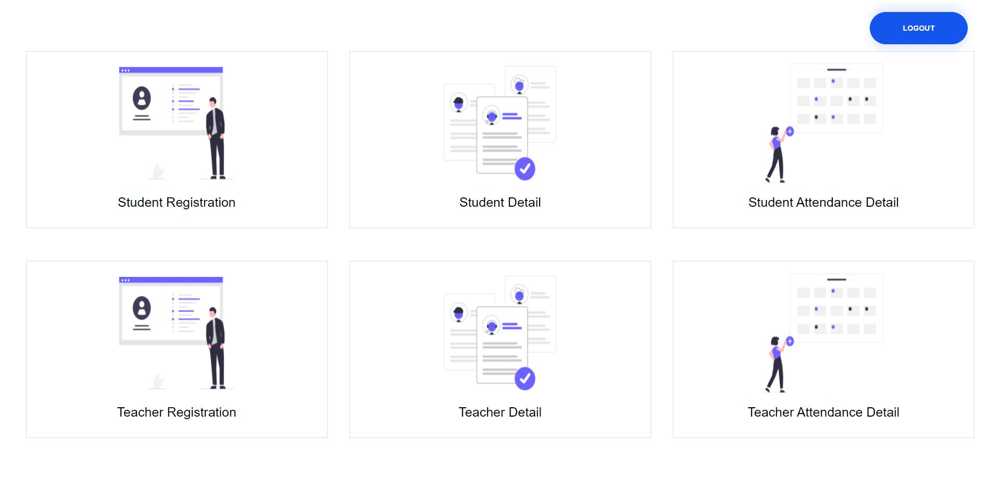
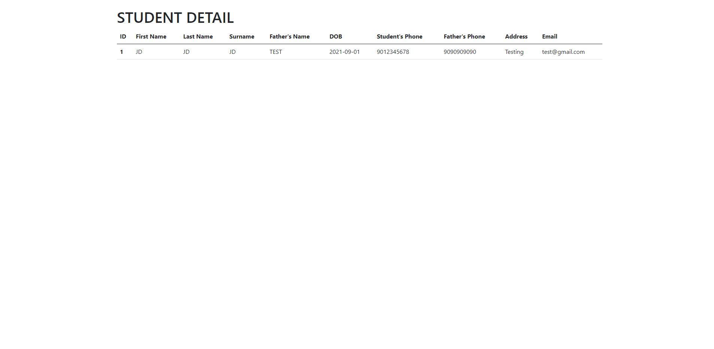
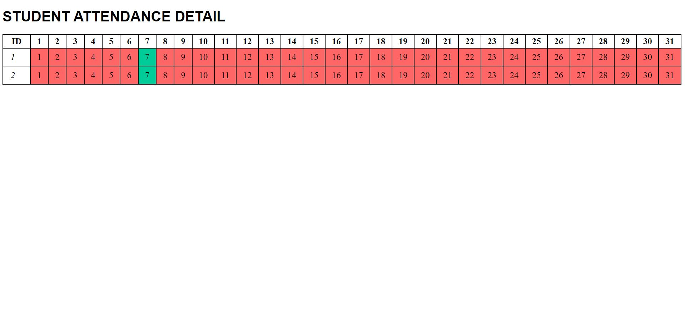

- Face Based Attendance System using Django
- User can take attendance of student as well as teacher.
- User can add new student and teacher.
- User can see the current month attendance of student and teacher.

<b>Dependency Used:</b>
- django : for web application
- openCV : for image and video processing
- pandas : for data processing
 
<b>Home Screen:</b> 

 
<b>Admin Login:</b> 

 
<b>Admin Dashboard:</b> 

 
<b>Student Registration:</b> 

 
<b>Student Details:</b> 

 
<b>Student Attendance Details:</b> 

